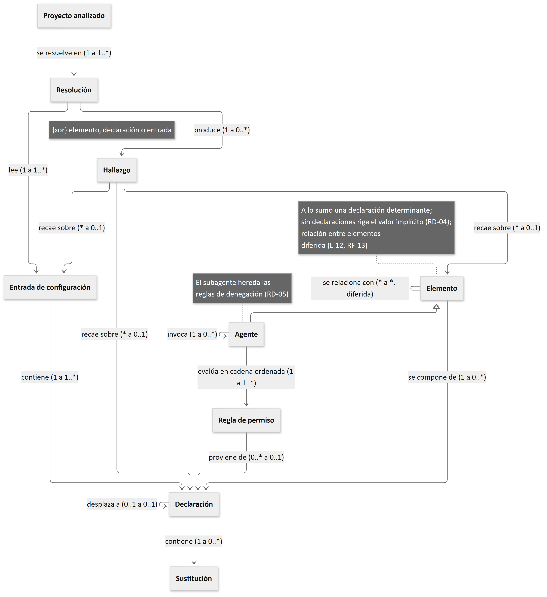

## III.2 · Dominio del Sistema de Información

### III.2.1 · Frontera entre el entorno y el dominio

El dominio comprende el recorte del mundo que el sistema representa y sobre cuyo estado responde. La frontera se traza elemento por elemento mediante una sola prueba: si el sistema controla el estado de esa cosa o si lo padece. Lo que RIGE recibe ya formado, y frente a lo cual solo puede adaptarse, integra el entorno; lo que RIGE construye y da por válido integra el dominio.

La aplicación de esa prueba produce un desdoblamiento que conviene declarar de manera expresa. Los archivos de configuración pertenecen al entorno, dado que RIGE no los modifica y los recibe con el contenido que otros escribieron. La representación que RIGE construye a partir de ellos pertenece, en cambio, al dominio: la declaración con su entrada, su archivo y su posición; la cadena ordenada de reglas de un agente; el hallazgo localizado; y la resolución fechada que agrupa todo ello. El archivo como registro externo y su representación resuelta constituyen dos objetos distintos, y esa distinción sostiene el modo de operación de solo lectura declarado en el apartado III.4.

### III.2.2 · Entidades del dominio

El modelado sigue el procedimiento de identificación de sustantivos del dominio (Larman, 2004). Los sustantivos se recolectan del vocabulario que la herramienta efectivamente emplea, tomado del esquema de configuración publicado, del código fuente analizado en el Anexo I, A.I.3 del informe de la AE1 y de la documentación de la versión 1.18.25, y se contrastan con los términos que la referente utiliza, de modo que el modelo y el informe compartan un único vocabulario con la organización (Evans, 2003). Cada candidata se somete a tres pruebas —identidad propia, datos y reglas propios, y pertenencia al recorte delimitado— e ingresa como entidad solo si las satisface todas. Los atributos de cada entidad constan en el Anexo V.

| **Entidad**              | **Definición operativa**                                                                             | **Fuente que la acredita**       | **Relaciones principales**                                                      |
|--------------------------|------------------------------------------------------------------------------------------------------|----------------------------------|---------------------------------------------------------------------------------|
| Proyecto analizado       | Contexto sobre el cual se resuelve el estado efectivo de la configuración                            | A.I.3, resultado 1               | Se resuelve en muchas resoluciones                                              |
| Resolución               | Estado efectivo del ecosistema obtenido en un momento determinado                                    | A.I.3, resultados 1 y 3          | Lee muchas entradas; produce muchos hallazgos                                   |
| Entrada de configuración | Vía por la cual OpenCode incorpora configuración al resolver el estado efectivo, sea o no un archivo | A.I.3, resultado 1               | Contiene muchas declaraciones                                                   |
| Declaración              | Asignación concreta escrita dentro de una entrada                                                    | A.I.3, resultados 3 y 6          | Compone un elemento; puede desplazar a otra declaración; contiene sustituciones |
| Sustitución              | Reemplazo de una variable de entorno o de un archivo dentro de una declaración                       | A.I.3, resultado 13              | Pertenece a una declaración; puede originar un hallazgo sobre ella              |
| Elemento                 | Unidad de configuración que RIGE resuelve y relaciona, cuyo tipo declara el adaptador                | A.I.3, resultado 1; AE1, Tabla 7 | Se compone de ninguna o muchas declaraciones; se relaciona con otros elementos  |
| Agente                   | Especialización de Elemento sobre la cual se manifiesta el efecto de toda la configuración           | A.I.3, resultados 5 y 12         | Evalúa una cadena de reglas; invoca subagentes                                  |
| Regla de permiso         | Regla que produce una decisión de permiso, nativa de la herramienta o escrita por el usuario en una declaración | A.I.3, resultados 5, 7 y 8 | Rige sobre agentes; ocupa una posición en la cadena; si es declarada, proviene de una declaración |
| Hallazgo                 | Defecto detectado en el ecosistema, con su localización                                              | A.I.3, resultados 3, 5 y 13      | Recae sobre un elemento, una declaración o una entrada                          |

*Tabla 2. Entidades del dominio, con su fuente y sus relaciones principales. Fuente: elaboración propia sobre el relevamiento técnico del Anexo I, A.I.3 del informe de la AE1.*

Las candidatas descartadas se conservan con su reclasificación, dado que el descarte documentado es lo que permite defender la delimitación adoptada.

| **Candidata**                                      | **Reclasificación**                               | **Criterio**                                                                    |
|----------------------------------------------------|---------------------------------------------------|---------------------------------------------------------------------------------|
| Valor efectivo                                     | Producto del sistema                              | Resulta de la resolución y carece de identidad fuera de ella                    |
| Procedencia | Atributo de otra entidad | Atributo del elemento, junto con su valor efectivo: es la cadena que conduce a la declaración determinante, no una cosa del dominio |
| Archivo | Atributo de otra entidad | Atributo de la entrada (su ruta). Como objeto del disco pertenece al entorno: el sistema lo recibe ya formado y no lo modifica |
| Consulta de permiso                                | Producto del sistema                              | Sus datos son referencias a otras entidades; no posee datos propios             |
| Desarrollador | Elemento del entorno | Actor externo, conforme al apartado III.1 |
| Agente que consume la salida por línea de comandos | Elemento del entorno | Sistema vecino, conforme al apartado III.1 (E-01) |
| Versión de OpenCode | Atributo de otra entidad | Atributo de la resolución y del proyecto analizado; opera además como restricción del entorno. No posee datos ni reglas propios dentro del sistema |
| Credencial de autenticación | Elemento del entorno | Excluida del alcance, conforme al apartado III.4 (L-03) |

*Tabla 3. Candidatas descartadas con su reclasificación. Fuente: elaboración propia.*

Una sola especialización se declara en el modelo. El Agente se modela como entidad diferenciada porque concentra comportamiento que los demás elementos no poseen —la cadena ordenada de reglas de permiso, la herencia de denegaciones hacia los subagentes que puede invocar y el conjunto de instrucciones aplicables— y porque constituye el eje de la representación. Los restantes tipos comparten el mismo tratamiento de resolución y relación, de modo que no justifican entidades separadas.

### III.2.3 · Modelo del dominio

Las relaciones se enuncian como frases del negocio, de modo que su validación consista en verificar si la frase resulta verdadera dicha en voz alta.

| **Relación**                                                                                         | **Cardinalidad** |
|------------------------------------------------------------------------------------------------------|------------------|
| Un proyecto analizado se resuelve en muchas resoluciones sucesivas                                   | 1 a N            |
| Una resolución lee muchas entradas de configuración                                                  | 1 a N            |
| Una entrada contiene muchas declaraciones                                                            | 1 a N            |
| Una declaración contiene ninguna o muchas sustituciones                                              | 1 a N, opcional  |
| Una declaración puede quedar desplazada por otra declaración de mayor precedencia                    | 1 a 1, opcional  |
| Un elemento se compone de ninguna o muchas declaraciones, de las cuales a lo sumo una resulta determinante; sin declaración rige el valor implícito | 1 a N, opcional |
| Un elemento se relaciona con muchos otros elementos, con un tipo de relación declarado               | N a N            |
| Un agente evalúa una cadena ordenada de muchas reglas de permiso                                     | 1 a N            |
| Una declaración origina ninguna o muchas reglas de permiso; una regla nativa no proviene de ninguna declaración | 1 a N, opcional |
| Un agente puede invocar muchos subagentes, y cada subagente hereda de aquel sus reglas de denegación | 1 a N, opcional  |
| Una resolución produce ninguno o muchos hallazgos                                                    | 1 a N, opcional  |
| Un hallazgo recae sobre un elemento, una declaración o una entrada                                   | 1 a 1            |

*Tabla 4. Relaciones del dominio y sus cardinalidades. Fuente: elaboración propia; validadas con la referente en la sesión del 26/09/2026, con tres correcciones posteriores que se le informan: la cardinalidad entre elemento y declaración, la entrada como destino de un hallazgo y el origen de la regla de permiso.*

{width="6in"}

*Figura 1. Modelo del dominio de RIGE. Entidades, relaciones y cardinalidades. Fuente: elaboración propia sobre el relevamiento del Anexo I, A.I.3 del informe de la AE1 y el acta de validación del 26/09/2026. La figura incorpora las correcciones posteriores de la Tabla 4.*

La relación reflexiva entre elementos representa los vínculos declarados en la Tabla 7 del informe de la AE1 —el modelo que un agente utiliza, el agente que un comando invoca, las herramientas que aporta un servidor MCP, las skills disponibles para cada agente— sin que el núcleo conozca ninguno de esos tipos. El tipo de cada elemento y el tipo de cada relación válida los declara el adaptador de la herramienta mediante su descriptor de capacidades, que no integra el dominio del negocio sino el contrato entre el adaptador y el núcleo, y sobre el cual se apoya el requisito RNF-03. La relación forma parte del modelo, aunque su representación en el sistema queda diferida como capacidad posterior (RF-13), conforme a la decisión L-12 validada en la sesión del 26/09/2026.

| **Tipo de elemento** | **Qué resuelve RIGE**                                                          | **Requisito**        |
|----------------------|--------------------------------------------------------------------------------|----------------------|
| Agente y subagente   | Valores efectivos, procedencia, declaraciones desplazadas y cadena de permisos | RF-01, RF-02, RF-06  |
| Modelo               | Modelo efectivo por agente y proveedor declarado                               | RF-01                |
| Instrucción          | Archivos que aplican y orden de incorporación                                  | RF-04                |
| Comando              | Definición efectiva y procedencia                                              | RF-01                |
| Skill                | Disponibilidad y ubicación                                                     | —                    |
| Servidor MCP         | Declaración efectiva y estado de habilitación                                  | RF-01                |
| Servidor LSP         | Servidor efectivo por lenguaje y estado de habilitación                        | RF-01                |
| Plugin               | Declaración, origen y estado de carga declarado                                | RF-01                |

*Tabla 5. Tipos de elemento que declara el adaptador de OpenCode 1.18.25, con el requisito que cubre su resolución. Fuente: elaboración propia sobre el Anexo I, A.I.3 del informe de la AE1 y el catálogo de requisitos del Anexo I.*

Las skills integran el modelo del dominio, pero ningún requisito compromete su resolución en este período: su disponibilidad para cada agente forma parte de la representación de vínculos diferida como capacidad posterior (RF-13), conforme a la decisión L-12, y su ubicación queda fuera del compromiso del período. RF-01 compromete la resolución de los demás tipos de elemento en la medida en que integran el estado efectivo de un agente, y su consulta independiente corresponde a RF-14.

### III.2.4 · Reglas de negocio y glosario

El dominio se gobierna por trece reglas de negocio, clasificadas en tres tipos: siete de derivación, que establecen cómo se calcula un dato a partir de otros; tres de restricción, que prohíben un estado o una transición; y tres de existencia, que condicionan la creación de una instancia. Las trece se validaron con la referente en la sesión del 26/09/2026. Las siete de derivación describen el comportamiento de OpenCode 1.18.25; cinco de ellas —RD-02, RD-03, RD-05, RD-06 y RD-07— se verificaron, además, mediante la ejecución de escenarios controlados, y las dos restantes, mediante la lectura del código fuente o de la salida de los comandos de introspección; las tres de existencia fijan cuándo el sistema registra un elemento o un hallazgo; y las tres de restricción derivan de decisiones de alcance. El registro completo, con enunciado verificable, fuente, estado y requisito derivado, consta en el Anexo V; la Tabla 6 reproduce una regla de cada tipo.

| **Cód.** | **Tipo**    | **Enunciado verificable**                                                                                                                                                                         | **Fuente**                        | **Estado**              | **Requisito derivado** |
|----------|-------------|---------------------------------------------------------------------------------------------------------------------------------------------------------------------------------------------------|-----------------------------------|-------------------------|------------------------|
| RD-03    | Derivación  | La decisión de permiso resulta de evaluar la cadena ordenada de reglas —nativas generales, nativas del agente, declaradas globales y declaradas del agente— y la determina la última coincidencia | H-05; acta del 26/09/2026 | Validada | RF-02                  |
| RR-01    | Restricción | RIGE no modifica ninguna entrada de configuración; escribe únicamente en su propio almacén                                                                                                        | Acta del 26/09/2026, decisión L-01 | Validada                | RNF-01                 |
| RE-02    | Existencia  | Una regla se marca sin efecto solo si existe una regla posterior del mismo tipo que abarca todos los casos que ella cubre                                                                         | H-05; Al-Shaer y Hamed (2004); acta del 26/09/2026 | Validada | RF-07                  |

*Tabla 6. Reglas de negocio representativas, una por tipo. Registro completo en el Anexo V. Fuente: elaboración propia.*

El glosario del dominio consta en el Anexo V y fija el vocabulario normativo de este informe. Dos términos presentaban un uso ambiguo, y ambos se resolvieron con la referente en la sesión del 26/09/2026. El primero es la denominación de las vías por las que llega la configuración: la documentación de la herramienta emplea *source*, el uso corriente alterna entre capa, alcance y nivel, y el informe de la AE1 alternaba entre fuente y entrada; se adopta «entrada de configuración» y se registran las demás como sinónimos. El segundo es el término «permiso», que el uso corriente emplea indistintamente para la decisión y para la regla que la produce; el informe reserva «permiso» para la decisión y «regla de permiso» para la declaración que la origina.
