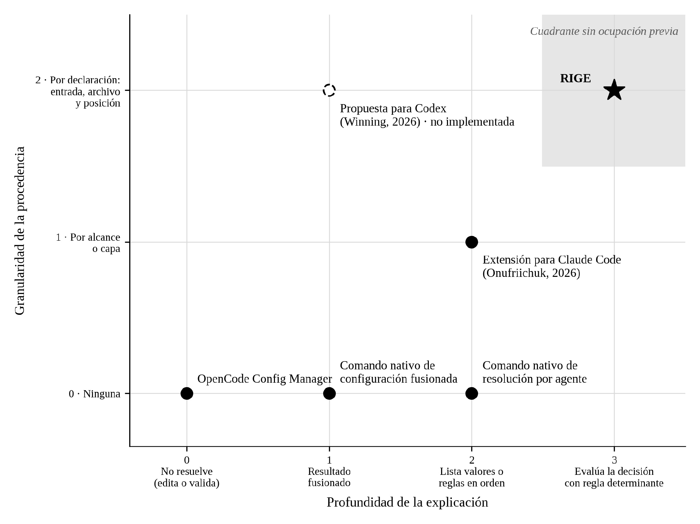

## IV.4 · Mapeo de competencia

Los ejes del mapa se construyen a partir de la definición de respuesta correcta del instrumento de la línea de base: una respuesta es correcta cuando coinciden el valor y su fuente o, en las condiciones de permisos, la decisión y la regla determinante (informe de la AE1, Anexo I, A.I.7). Cada mitad de esa definición origina un eje, y ambas corresponden a las dimensiones con que se relevó cada solución (A.I.4) y a la distinción del hallazgo 5 entre listar reglas y explicar una decisión.

El eje horizontal mide la profundidad de la explicación en cuatro niveles: no resuelve el estado efectivo, muestra el resultado de la fusión, lista valores o reglas en orden de evaluación, o evalúa la decisión para una acción con su regla determinante. El eje vertical mide la granularidad de la procedencia en tres niveles: ninguna, por alcance o capa, o por declaración, con su entrada, archivo y posición. Cada solución se ubica según la prueba directa registrada en el Anexo I, A.I.4 del informe de la AE1.

{width="5.625in" height="4.21875in"}

*Figura 2. Mapa de posicionamiento de las soluciones relevadas según la profundidad de la explicación y la granularidad de la procedencia. La propuesta para Codex se representa con trazo discontinuo por no estar implementada. Fuente: elaboración propia sobre el Anexo I, A.I.4 del informe de la AE1.*

RIGE ocupa el cuadrante que ninguna solución relevada alcanza: la evaluación de la decisión con procedencia por declaración. La solución más próxima, la extensión para Claude Code, informa la procedencia por alcance y lista reglas sin evaluar una decisión; el comando nativo de resolución por agente es el único que presenta las reglas nativas, aunque sin su origen. La amenaza se ubica en el eje vertical: la propuesta para Codex muestra que un proveedor puede alcanzar la procedencia por declaración sin avanzar en la explicación. El diferencial defendible reside, por lo tanto, en el eje horizontal, conclusión que coincide con la implicancia de los competidores potenciales del apartado IV.3.

Dos conjuntos quedan fuera del mapa. Los precedentes de dominios maduros, como la resolución de configuración con origen de los sistemas de control de versiones y los simuladores de políticas de acceso, combinan ambas dimensiones en sus propios dominios, pero no operan sobre herramientas basadas en agentes: constituyen el origen del diseño y no competencia. Los sustitutos carecen de una posición fija, dado que su resultado depende de quien los ejecuta y no es verificable; su análisis consta en el apartado IV.3.

Se evalúan y descartan dos ejes alternativos. El precio no discrimina, porque todas las soluciones relevadas son gratuitas. La cobertura de herramientas discrimina en contra de RIGE, que en esta etapa cubre una sola; se descarta porque no mide la respuesta que el instrumento considera correcta, y la posición desfavorable se declara porque corresponde a la exclusión L-05 y a la visión del apartado IV.2, que la aborda mediante adaptadores.
