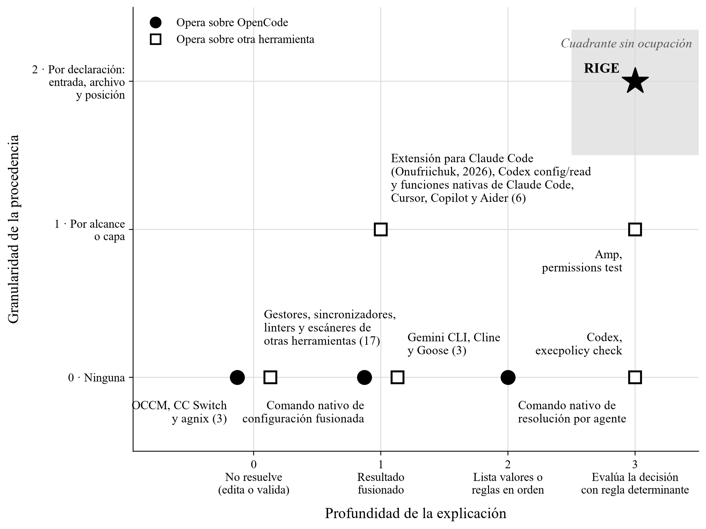

## IV.4 · Mapeo de competencia

Los ejes del mapa se construyen a partir de la definición de respuesta correcta del instrumento de la línea de base: una respuesta es correcta cuando coinciden el valor y su fuente o, en las condiciones de permisos, la decisión y la regla determinante (informe de la AE1, Anexo I, A.I.7). Cada mitad de esa definición origina un eje, y ambas corresponden a las dimensiones con que se relevó cada solución (A.I.4) y a la distinción del hallazgo 5 entre listar reglas y explicar una decisión, precisada con el relevamiento del apartado IV.3.

El eje horizontal mide la profundidad de la explicación en cuatro niveles: no resuelve el estado efectivo, muestra el resultado de la fusión, lista valores o reglas en orden de evaluación, o evalúa la decisión para una acción con su regla determinante. El eje vertical mide la granularidad de la procedencia en tres niveles: ninguna, por alcance o capa, o por declaración, con su entrada, archivo y posición. Cada solución se ubica según el relevamiento del 01/10/2026 registrado en el Anexo I, A.I.4 del informe de la AE1.

{width="5.625in" height="4.21875in"}

*Figura 2. Mapa de posicionamiento de las soluciones relevadas según la profundidad de la explicación y la granularidad de la procedencia. El círculo identifica soluciones sobre OpenCode y el cuadrado, sobre otras herramientas; las que comparten posición se agrupan con su cantidad. Fuente: elaboración propia sobre el relevamiento del 01/10/2026 (Anexo I, A.I.4 del informe de la AE1).*

RIGE ocupa el cuadrante de evaluación de la decisión con procedencia por declaración (3, 2), que ninguna de las 33 soluciones incluidas en el relevamiento del 01/10/2026 alcanza. Las más próximas son Amp, que evalúa la decisión con procedencia por alcance, y Codex, que evalúa comandos de shell sin procedencia de la regla; sobre OpenCode, el comando nativo de resolución por agente es el más próximo. El diferencial combina ambos ejes, en concordancia con la implicancia de los competidores potenciales del apartado IV.3.

Dos conjuntos quedan fuera del mapa. Los precedentes de dominios maduros, como la resolución de configuración con origen de los sistemas de control de versiones y los simuladores de políticas de acceso, combinan ambas dimensiones en sus propios dominios, pero no operan sobre herramientas basadas en agentes: constituyen el origen del diseño y no competencia. Los procedimientos manuales y delegados carecen de una posición fija, dado que su resultado depende de quien los ejecuta; su análisis consta en el apartado IV.3. Los sincronizadores publicados sí se incluyen en el mapa, según sus capacidades documentadas.

Se evalúan y descartan dos ejes alternativos. El precio no discrimina, porque las soluciones relevadas son gratuitas o tienen una modalidad gratuita. La cobertura de herramientas discrimina en contra de RIGE, que en esta etapa cubre una sola; se descarta porque no mide la respuesta que el instrumento considera correcta, y la posición desfavorable se declara porque corresponde a la exclusión L-05 y a la visión del apartado IV.2, que la aborda mediante adaptadores.
