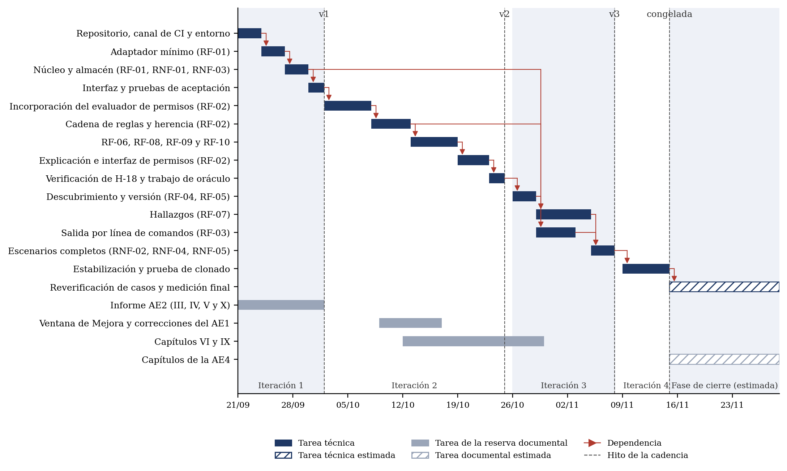

## V.4 · Cronograma

El presupuesto se construye sobre las horas semanales reales que el autor dedica al proyecto, declaradas en el Instrumento 24, y no sobre la duración nominal del cuatrimestre. Esas horas se declaran en dos líneas con destino distinto: la capacidad técnica, que se asigna a las iteraciones y determina cuántos requisitos Must caben en el período, y una reserva documental y de validación, que financia la redacción de los capítulos, las correcciones de las actividades de evaluación y la preparación de las mediciones. La reserva no se asigna a requisitos ni opera como margen de contingencia, dado que sus entregables tienen fecha fija. La reducción prevista del 15 % considera las semanas de exámenes y el feriado del 12 de octubre, y se distribuye de manera proporcional entre las iteraciones.

| **Presupuesto de horas-persona**                 | **Valor declarado**                                                                      |
|--------------------------------------------------|------------------------------------------------------------------------------------------|
| Integrantes del equipo                           | 1, de autoría individual                                                                 |
| Horas semanales reales por integrante            | 28 h: 20 técnicas y 8 de reserva documental                                              |
| Presupuesto total del período                    | 224 h en ocho semanas, del 21/09 al 14/11/2026: 160 técnicas y 64 de reserva             |
| Reducción prevista (exámenes, feriados)          | 15 %, equivalente a 34 h: 24 técnicas y 10 de reserva                                    |
| **Presupuesto efectivo resultante**              | **190 h: 136 técnicas y 54 de reserva**                                                  |
| Fase de cierre posterior al período (estimación) | 48 h efectivas en las semanas 15 y 16, sujetas a la confirmación de las fechas de la AE4 |

*Tabla 17. Presupuesto de horas-persona del proyecto. Fuente: elaboración propia sobre el Instrumento 24.*

La capacidad técnica efectiva asciende a 34 h en la primera iteración, 51 h en la segunda, 34 h en la tercera y 17 h en la cuarta, en proporción a sus dos, tres, dos y una semanas. La reserva efectiva se distribuye en 14 h para el cierre del informe de la AE2, 20 h para la Ventana de Mejora y Cumplimiento y las correcciones del informe de la AE1, 13 h para los Capítulos VI y IX y 7 h para la preparación de la medición final. La fase de cierre se declara por separado porque la cátedra no fijó todavía las fechas de la cuarta actividad de evaluación: su duración se estima en dos semanas a partir de la correspondencia de clases de la consigna, y sus horas financian la medición final, la constancia de la referente y los capítulos restantes del informe. Una modificación de esas fechas altera esa línea y no el alcance comprometido.

La estimación descompone cada iteración en tareas y les asigna horas por juicio del autor, sobre la base de su experiencia en desarrollo de software (Cohn, 2005). La Tabla 18 presenta el resultado: los requisitos Must ocupan la totalidad de las 136 h técnicas.

| **Iteración** | **Tarea**                                                                           | **Requisitos**                              | **Horas** |
|---------------|-------------------------------------------------------------------------------------|---------------------------------------------|-----------|
| 1             | Repositorio, canal de integración continua y entorno de ejecución                   | Condición (a) de la definición de terminado | 8         |
| 1             | Adaptador mínimo: lectura de tres entradas de archivo con su posición               | RF-01                                       | 8         |
| 1             | Núcleo: resolución con procedencia conforme a RD-01                                 | RF-01, RNF-03                               | 6         |
| 1             | Almacén propio: esquema, escritura y lectura de la resolución                       | RNF-01                                      | 4         |
| 1             | Interfaz mínima de selección del proyecto y consulta                                | RF-01                                       | 4         |
| 1             | Pruebas de aceptación y primeros resultados de referencia                           | RF-01, RNF-01, RNF-03                       | 4         |
|               | **Subtotal de la iteración 1**                                                      |                                             | **34**    |
| 2             | Incorporación del evaluador de permisos de OpenCode, con atribución                 | RF-02                                       | 10        |
| 2             | Cadena ordenada de reglas y herencia hacia subagentes conforme a RD-03 y RD-05      | RF-02                                       | 10        |
| 2             | Valores implícitos y reglas nativas                                                 | RF-06                                       | 6         |
| 2             | Comando compuesto, protección nativa desactivada y disponibilidad de la herramienta | RF-08, RF-09, RF-10                         | 12        |
| 2             | Explicación mediante plantillas deterministas                                       | RF-02                                       | 5         |
| 2             | Interfaz de consulta de permiso                                                     | RF-02                                       | 4         |
| 2             | Verificación de H-18 y trabajo de oráculo                                           | RNF-02                                      | 4         |
|               | **Subtotal de la iteración 2**                                                      |                                             | **51**    |
| 3             | Descubrimiento de las entradas aplicables y de su legibilidad                       | RF-04                                       | 8         |
| 3             | Advertencia ante una versión distinta                                               | RF-05                                       | 2         |
| 3             | Seis tipos de hallazgo con su explicación                                           | RF-07                                       | 12        |
| 3             | Salida estructurada por línea de comandos                                           | RF-03                                       | 6         |
| 3             | Conjunto completo de escenarios y verificaciones de seguridad                       | RNF-02, RNF-04, RNF-05                      | 4         |
| 3             | Interfaz de hallazgos                                                               | RF-07                                       | 2         |
|               | **Subtotal de la iteración 3**                                                      |                                             | **34**    |
| 4             | Corrección de defectos, regresión completa, prueba de clonado y archivo de lectura  | Requisitos Must                             | 17        |
|               | **Total de la capacidad técnica efectiva**                                          |                                             | **136**   |

*Tabla 18. Estimación de horas por tarea e iteración. Fuente: elaboración propia.*

Los cuatro requisitos Should no reciben horas. Se ejecutan en la tercera iteración solo si las anteriores cierran por debajo de lo estimado, lo que otorga contenido verificable a su condición de comprometidos de manera condicionada, declarada en el apartado III.3. La cuarta iteración opera como margen para la corrección de defectos y no para incorporar funcionalidad.

La Figura 3 ordena las tareas según sus dependencias. En la primera iteración, la ruta crítica encadena el repositorio con su canal, el adaptador, el núcleo con el almacén y la interfaz, dado que el esqueleto solo acredita la arquitectura cuando atraviesa todas las capas. La segunda depende de la incorporación del evaluador de permisos, sobre el cual se construye la cadena de reglas y, a partir de ella, las advertencias, la disponibilidad de la herramienta y la explicación; constituye el punto de mayor riesgo de integración del proyecto y por ese motivo ocupa su comienzo. En la tercera, la detección de hallazgos depende del descubrimiento completo de las entradas y de la cadena de reglas, sobre la cual se identifican las reglas sin efecto; la salida por línea de comandos depende solo del núcleo, pero su prueba de igualdad con la interfaz de escritorio exige ambas. La medición final depende de la versión congelada y de la reverificación previa de los ocho casos del instrumento.

La cláusula de contingencia opera sobre la capacidad técnica, que es la que determina los requisitos comprometidos. Una caída de un tercio reduce las 136 h a 91 h, y la pérdida de 45 h se absorbe mediante las postergaciones de la Tabla 19, aplicadas en el orden indicado hasta cubrirla.

| **Orden** | **Qué se posterga**                                                                                                       | **Horas liberadas** | **Acumulado** |
|-----------|---------------------------------------------------------------------------------------------------------------------------|---------------------|---------------|
| 1         | Requisitos Should RF-11, RNF-06, RNF-07 y RNF-08, que carecen de horas asignadas                                          | 0                   | 0             |
| 2         | Regeneración automática de los resultados de referencia, sustituida por una regeneración manual registrada en la bitácora | 2                   | 2             |
| 3         | RF-03 · salida por línea de comandos (CU-05)                                                                              | 6                   | 8             |
| 4         | RF-10 · disponibilidad de la herramienta para el modelo                                                                   | 4                   | 12            |
| 5         | RF-04 · descubrimiento completo; se conservan las entradas de archivo del v1                                              | 8                   | 20            |
| 6         | RF-07 · hallazgos, con su interfaz (CU-04)                                                                                | 14                  | 34            |
| 7         | Estabilización, reducida de 17 h a 6 h en proporción al alcance conservado                                                | 11                  | 45            |

*Tabla 19. Cláusula de contingencia ante una caída de un tercio de la capacidad técnica. Fuente: elaboración propia sobre la Tabla 18.*

El orden responde a un criterio único: se posterga primero lo que no interviene en la medición final ni en la mitigación del riesgo principal y, dentro de ello, lo que debilita en menor medida un objetivo específico. Por ese motivo la salida por línea de comandos precede a la detección de hallazgos: sin RF-03, el OE-1 pierde únicamente su verificación por esa interfaz, mientras que sin RF-07 el OE-3 queda sin cumplir. Dado que el proyecto es individual, la redistribución no transfiere trabajo entre integrantes sino entre iteraciones: lo postergado vuelve a la iteración siguiente si la capacidad se recupera. Toda postergación se registra en la bitácora y en el tablero y se refleja en la prioridad del catálogo, porque postergar un requisito Must modifica el producto mínimo viable del apartado V.5 y ese cambio debe quedar declarado.

No se sacrifican en ningún caso la trazabilidad del catálogo y la ejecutabilidad de cada etiqueta, que la cátedra fija como condiciones de cómputo; la fidelidad respecto de OpenCode 1.18.25 (RNF-02), que constituye la mitigación del riesgo principal; las restricciones de seguridad RNF-01, RNF-04 y RNF-05; y los casos de uso sobre los que se ejecuta la medición final —CU-01 en su forma mínima con la advertencia de versión, CU-02 y CU-03 con RF-02, RF-06, RF-08 y RF-09—, cuya pérdida suprimiría el flujo de valor seleccionado en el apartado IV.3.

{width="6.2in"}

*Figura 3. Cronograma del proyecto con dependencias entre tareas y los hitos de la cadencia. Las barras rayadas corresponden a la fase de cierre, cuya duración se estima. Fuente: elaboración propia.*
