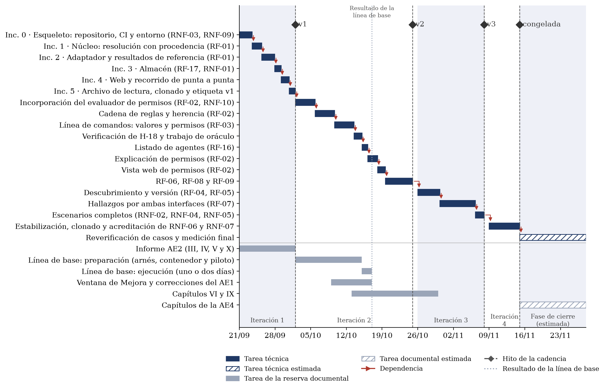

## V.4 · Cronograma

El presupuesto se construye sobre las horas semanales reales que el autor dedica al proyecto, declaradas en el Instrumento 24, y no sobre la duración nominal del cuatrimestre. Esas horas se declaran en dos líneas con destino distinto: la capacidad técnica, que se asigna a las iteraciones y determina cuántos requisitos Must caben en el período, y una reserva documental y de validación, que financia la redacción de los capítulos, las correcciones de las actividades de evaluación y la preparación de las mediciones. La reserva no se asigna a requisitos ni opera como margen de contingencia, dado que sus entregables tienen fecha fija. La reducción prevista del 15 % considera las semanas de exámenes y el feriado del 12 de octubre, y se distribuye de manera proporcional entre las iteraciones.

| **Presupuesto de horas-persona**                 | **Valor declarado**                                                                      |
|--------------------------------------------------|------------------------------------------------------------------------------------------|
| Integrantes del equipo                           | 1, de autoría individual                                                                 |
| Horas semanales reales por integrante            | 28 h: 20 técnicas y 8 de reserva documental                                              |
| Presupuesto total del período                    | 224 h en ocho semanas, del 21/09 al 14/11/2026: 160 técnicas y 64 de reserva             |
| Reducción prevista (exámenes, feriados)          | 15 %, equivalente a 34 h: 24 técnicas y 10 de reserva                                    |
| **Presupuesto efectivo resultante**              | **190 h: 136 técnicas y 54 de reserva**                                                  |
| Fase de cierre posterior al período (estimación) | 48 h efectivas en las semanas 15 y 16, sujetas a la confirmación de las fechas de la AE4 |

*Tabla 17. Presupuesto de horas-persona del proyecto. Fuente: elaboración propia sobre el Instrumento 24.*

La capacidad técnica efectiva se distribuye en proporción a los días de cada iteración, que son 11, 23, 13 y 6: 28 h en la primera, 59 h en la segunda, 33 h en la tercera y 16 h en la cuarta. El plan asigna 35, 60, 30 y 11 h, respectivamente. La primera iteración excede su capacidad en 7 h y la segunda en 1 h; el exceso se declara y se compensa con la holgura de la tercera y la cuarta, de 3 y 5 h, dado que lo que al 01/10 no satisfaga la definición de terminado, sin afectar el criterio del v1, pasa a la segunda iteración por el criterio de corte del apartado V.1. La reserva efectiva se distribuye en 14 h para el cierre del informe de la AE2, 20 h para la Ventana de Mejora y Cumplimiento y las correcciones del informe de la AE1, 13 h para los Capítulos VI y IX y 7 h para la preparación de la medición final. La reserva de la Ventana comprende, además, la ejecución de la línea de base con agentes de programación, estimada en 16 a 23 h, compensada con la preparación de la medición final, que se reduce a volver a ejecutar el guion. La fase de cierre se declara por separado porque la cátedra no fijó todavía las fechas de la cuarta actividad de evaluación: su duración se estima en dos semanas a partir de la correspondencia de clases de la consigna, y sus horas financian la medición final, la constancia de la referente y los capítulos restantes del informe. Una modificación de esas fechas altera esa línea y no el alcance comprometido.

La estimación descompone cada iteración en tareas y les asigna horas por juicio del autor, sobre la base de su experiencia en desarrollo de software (Cohn, 2005). La Tabla 18 presenta el resultado: los requisitos Must ocupan las 136 h técnicas, con la salvedad de que la estabilización de la cuarta iteración absorbe, sin horas propias, la acreditación de RNF-06 y RNF-07, ambos Should.

| **Iteración** | **Tarea**                                                                           | **Requisitos**                              | **Horas** |
|---------------|-------------------------------------------------------------------------------------|---------------------------------------------|-----------|
| 1             | Repositorio, canal de integración continua y entorno de ejecución                   | Condición (a) de la definición de terminado | 8         |
| 1             | Adaptador mínimo: lectura de tres entradas de archivo con su posición               | RF-01                                       | 8         |
| 1             | Núcleo: resolución con procedencia conforme a RD-01                                 | RF-01, RNF-03                               | 6         |
| 1             | Almacén propio: esquema, escritura y lectura de la resolución                       | RF-17, RNF-01                               | 4         |
| 1             | Interfaz mínima de selección del proyecto y consulta                                | RF-01, RNF-09                               | 5         |
| 1             | Pruebas de aceptación y primeros resultados de referencia                           | RF-01, RNF-01, RNF-03                       | 4         |
|               | **Subtotal de la iteración 1**                                                      |                                             | **35**    |
| 2             | Incorporación del evaluador de permisos de OpenCode, con atribución                 | RF-02, RNF-10                               | 10        |
| 2             | Cadena ordenada de reglas y herencia hacia subagentes conforme a RD-03 y RD-05      | RF-02                                       | 10        |
| 2             | Valores implícitos y reglas nativas                                                 | RF-06                                       | 6         |
| 2             | Comando compuesto y protección nativa desactivada                                   | RF-08, RF-09                                | 8         |
| 2             | Explicación mediante plantillas deterministas                                       | RF-02                                       | 5         |
| 2             | Vista web de consulta de permiso                                                    | RF-02                                       | 4         |
| 2             | Salida por línea de comandos: valores y decisiones de permiso, con esquema versionado y explicación a pedido | RF-03                              | 10        |
| 2             | Verificación de H-18 y trabajo de oráculo, incluida la regeneración automática de los resultados de referencia | RNF-02                   | 4         |
| 2             | Listado de los agentes declarados y nativos, por ambas interfaces                   | RF-16                                       | 3         |
|               | **Subtotal de la iteración 2**                                                      |                                             | **60**    |
| 3             | Descubrimiento de las entradas aplicables y de su legibilidad                       | RF-04                                       | 8         |
| 3             | Advertencia ante una versión distinta                                               | RF-05                                       | 2         |
| 3             | Seis tipos de hallazgo con su explicación                                           | RF-07                                       | 12        |
| 3             | Conjunto completo de escenarios y verificaciones de seguridad                       | RNF-02, RNF-04, RNF-05                      | 4         |
| 3             | Vista web y salida por línea de comandos de los hallazgos                           | RF-07                                       | 4         |
|               | **Subtotal de la iteración 3**                                                      |                                             | **30**    |
| 4             | Corrección de defectos, regresión completa, prueba de clonado y archivo de lectura; acreditación de RNF-06 y RNF-07 | Requisitos Must; RNF-06 y RNF-07 | 11        |
|               | **Total de la capacidad técnica efectiva**                                          |                                             | **136**   |

*Tabla 18. Estimación de horas por tarea e iteración. Fuente: elaboración propia.*

Los seis requisitos Should no reciben horas. RF-12 se incorpora en la segunda iteración y RF-10, RF-11 y RNF-08 en la tercera, si las anteriores cierran por debajo de lo estimado; la acreditación de RNF-06 y RNF-07, que incluye la corrida en Windows 11 y la medición por etapas en ambas plataformas, se ejecuta dentro de la estabilización de la cuarta iteración, sin horas propias, y es lo primero que cae si esa estabilización se reduce. La cuarta iteración opera como margen para la corrección de defectos y no para incorporar funcionalidad.

La Figura 3 ordena las tareas según sus dependencias. En la primera iteración, la ruta crítica encadena el repositorio con su canal, el adaptador, el núcleo con el almacén y la interfaz, dado que el esqueleto solo acredita la arquitectura cuando atraviesa todas las capas. La segunda depende de la incorporación del evaluador de permisos, sobre el cual se construye la cadena de reglas; constituye el punto de mayor riesgo de integración del proyecto y por ese motivo ocupa su comienzo. El evaluador, la cadena de reglas y la salida por línea de comandos (RF-03), que depende del núcleo y del evaluador, preceden al resultado de la línea de base, previsto para el 16/10, porque no dependen de él; la verificación de H-18 y el listado de los agentes (RF-16), que depende de ella, completan ese tramo. A partir de ese resultado, la Tabla 13 del apartado IV.3 fija el orden de lo que resta: si confirma la selección del flujo, la explicación y la vista web de permisos preceden a RF-06, RF-08 y RF-09; si la reordena, RF-06 pasa al frente. La vista web de permisos depende de la línea de comandos, con cuyos resultados debe coincidir. En la tercera, la detección de hallazgos depende del descubrimiento completo de las entradas y de la cadena de reglas, sobre la cual se identifican las reglas sin efecto; la vista web de hallazgos depende de la línea de comandos, con cuyos resultados debe coincidir. La medición final depende de la versión congelada y de la reverificación previa de los dieciséis casos del instrumento.

La cláusula de contingencia opera sobre la capacidad técnica, que es la que determina los requisitos comprometidos. La magnitud de la caída, un tercio del presupuesto, la fija la consigna de la AE2 en su exigencia (vii). Esa caída reduce las 136 h a 91 h, y la pérdida de 45 h se absorbe mediante las postergaciones de la Tabla 19, aplicadas en el orden indicado hasta cubrirla.

| **Orden** | **Qué se posterga**                                                                                                       | **Horas liberadas** | **Acumulado** |
|-----------|---------------------------------------------------------------------------------------------------------------------------|---------------------|---------------|
| 1         | Requisitos Should RF-10, RF-11, RF-12, RNF-06, RNF-07 y RNF-08, que carecen de horas asignadas, incluidas las acreditaciones en Windows 11 y de RNF-07 dentro de la estabilización | 0 | 0 |
| 2         | Regeneración automática de los resultados de referencia, sustituida por una regeneración manual registrada en la bitácora | 2                   | 2             |
| 3         | Vista web de consulta de permiso; la decisión se conserva por línea de comandos; la parte de los criterios de RF-02 y RF-03 que exige coincidencia con la interfaz web queda sin cumplir | 4                   | 6             |
| 4         | Explicación en lenguaje natural de las decisiones de permiso, mediante plantillas de RF-02 y explicación a pedido         | 5                   | 11            |
| 5         | RF-04 · descubrimiento completo; se conservan las entradas de archivo del v1                                              | 8                   | 19            |
| 6         | RF-07 · hallazgos, con su vista web y su salida por línea de comandos (CU-04)                                             | 16                  | 35            |
| 7         | Estabilización, reducida de 11 h a 1 h                                                                                    | 10                  | 45            |

*Tabla 19. Cláusula de contingencia ante una caída de un tercio de la capacidad técnica. Fuente: elaboración propia sobre la Tabla 18.*

El orden responde a un criterio único: se posterga primero lo que no interviene en la medición final ni en la mitigación del riesgo principal y, dentro de ello, lo que debilita en menor medida un objetivo específico. Por ese motivo la vista web de permisos y la explicación en lenguaje natural preceden a la detección de hallazgos: sin ellas, la decisión y su regla determinante siguen disponibles por línea de comandos, que es la vía por la que el agente consulta en la medición final, mientras que sin RF-07 el OE-3 queda sin cumplir. La vista web se posterga antes que la explicación, porque la explicación constituye el diferencial del producto. Si la cláusula se aplica completa, el OE-2 se conserva por línea de comandos, con la decisión y la regla determinante; el OE-1 se reduce a las entradas de archivo del v1; y el OE-3 queda sin cumplir. Con una caída de 11 h o menos, que cubren los órdenes 1 a 4, los tres objetivos se conservan, con la pérdida de la explicación en prosa y de la paridad con la interfaz web en las decisiones de permiso. Dado que el proyecto es individual, la redistribución no transfiere trabajo entre integrantes sino entre iteraciones: lo postergado vuelve a la iteración siguiente si la capacidad se recupera. Toda postergación se registra en la bitácora y en el tablero y se refleja en la prioridad del catálogo, porque postergar un requisito Must modifica el producto mínimo viable del apartado V.5 y ese cambio debe quedar declarado.

No se sacrifican en ningún caso la trazabilidad del catálogo y la ejecutabilidad de cada etiqueta, que la cátedra fija como condiciones de cómputo; la fidelidad respecto de OpenCode 1.18.25 (RNF-02), que constituye la mitigación del riesgo principal; las restricciones de seguridad RNF-01, RNF-04 y RNF-05; y los casos de uso y el requisito de interfaz sobre los que se ejecuta la medición final: CU-01 en su forma mínima con la advertencia de versión; CU-02; CU-03, con la decisión de RF-02 —no su explicación en prosa—, RF-06, RF-08 y RF-09; y RF-03, la consulta de valores y de permisos por línea de comandos, que es la vía del agente en la medición final. La pérdida de estos casos de uso y de RF-03 suprimiría el flujo de valor seleccionado en el apartado IV.3.

{width="6.2in"}

*Figura 3. Cronograma del proyecto con dependencias entre tareas y los hitos de la cadencia. Las barras rayadas corresponden a la fase de cierre, cuya duración se estima. Fuente: elaboración propia.*
